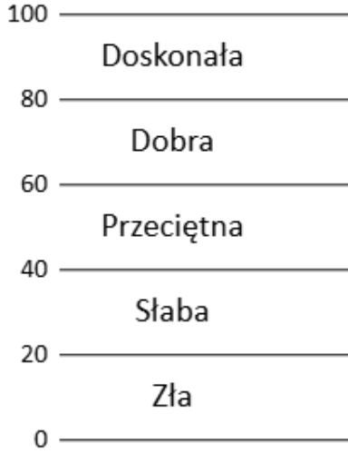
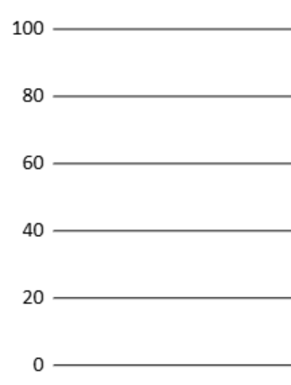

# Listening test instructions

Below are the exact instructions presented to participants.
The experiment used two graphical interface variants:
- **labeled** (quality labels “Excellent”, “Good”, “Fair”, “Poor”, “Bad”)
- **unlabeled** (no internal labels, only endpoints 0 and 100).

Where the interface or scale image differs, both versions are shown.
The remaining pages were identical for all participants.

---

## Common pages (both variants)

### Witaj! (Welcome)

**Polish**  
Ta strona zawiera test odsłuchowy, który zajmie Ci około 15 minut. Podczas testu będziesz poproszony o wysłuchanie krótkich nagrań oraz ocenę ich jakości.  
Wymagane jest użycie słuchawek.  
Badanie jest częścią pracy doktorskiej realizowanej przez współautora niniejszej strony (Ihar Balyka, Politechnika Białostocka).

**English**  
This page contains a listening test that will take you about 15 minutes. During the test you will be asked to listen to short recordings and evaluate their quality.  
Headphones are required.  
The study is part of a doctoral thesis carried out by the co‑author of this website (Ihar Balyka, Białystok University of Technology).

---

### Warunki udziału i polityka prywatności (Consent & Privacy)

**Polish**  
1. Badania przygotowane są zgodnie z powszechnie akceptowaną metodologią.  
2. Odpowiedzialność za wyregulowanie głośności odtwarzanego dźwięku do bezpiecznego i komfortowego poziomu leży po stronie uczestnika.  
3. Badacze nie ponoszą odpowiedzialności za jakiekolwiek straty słuchu czy uszkodzenia powstałe w wyniku błędnego ustawienia systemu odsłuchowego.  
4. Dane zebrane podczas badań przetworzone zostaną w sposób anonimowy.  
5. Udział w eksperymencie uczestnik może przerwać w dowolnej chwili bez podania przyczyny.  
6. Dane wykorzystane zostaną wyłącznie do celów naukowych.  
Badanie uzyskało pozytywną opinię Komisji Etyki PB.

**English**  
1. The study has been prepared in accordance with generally accepted methodology.  
2. The responsibility for adjusting the playback volume to a safe and comfortable level lies with the participant.  
3. The researchers are not responsible for any hearing loss or damage resulting from incorrect setting of the listening system.  
4. The data collected during the study will be processed anonymously.  
5. The participant may stop participating in the experiment at any time without giving a reason.  
6. The data will be used solely for scientific purposes.  
The study received a positive opinion from the Ethics Committee of Białystok University of Technology.

---

### Dopasowanie głośności (Volume adjustment)

**Polish**  
Poziom odtwarzanego dźwięku należy dostosować do swoich preferencji, używając do tego celu regulatora w swoim systemie komputerowym lub w słuchawkach.  
**Uwaga! Przed przystąpieniem do testu upewnij się, że regulator głośności jest w pozycji minimalnej. Poziom należy wyregulować stopniowo począwszy od wartości minimalnej.**

**English**  
The playback volume should be adjusted to your preferences using the volume control in your computer system or headphones.  
**Caution! Before starting the test, make sure the volume control is at its minimum. The level should be adjusted gradually, starting from the minimum value.**

---

### Aplikacja komputerowa (Computer application)

**Polish**  
W eksperymencie wykorzystana zostanie aplikacja komputerowa (obrazy poniżej). Aby rozpocząć odtwarzanie dźwięku, należy nacisnąć jeden z przycisków Play. Do wyłączenia dźwięku służy przycisk Stop lub Pauza.  
Oceniane próbki dźwięku oznaczono jako A 1, A 2, A 3, itd.  
Aby dokonać oceny, należy kliknąć myszką na przycisk Play ocenianej próbki, a następnie odpowiednio przesunąć suwak na skali ocen.

**Wersja z etykietami (labeled):**  

**Wersja bez etykiet (unlabeled):**  

**English**  
The experiment will use a computer application (see images below). To start playback, press one of the Play buttons. To stop the sound, use the Stop or Pause button.  
The audio samples to be evaluated are labelled A 1, A 2, A 3, etc.  
To make an assessment, click the Play button of the sample you wish to evaluate, then move the slider on the rating scale accordingly.

**Labeled variant:**  

**Unlabeled variant:**  

---

## Task description – labeled scale

*Used in the experiment variant with quality labels.*

### Polish

**Twoje zadanie**  
**Twoim zadaniem jest odsłuchanie poszczególnych próbek dźwiękowych, a następnie ocenienie ich *jakości* w porównaniu z jakością próbki Odniesienia.**

**Skala ocen**  
Do oceny jakości dźwięku wykorzystano 100‑stopniową skalę ocen zilustrowaną poniżej.  

Skala posiada zakres od 0 do 100 punktów i jest numerycznie ciągła. Reprezentuje ona następujące kategorie jakości dźwięku: **Doskonała, Dobra, Przeciętna, Słaba, Zła**.  
Ocena 0 odpowiada dolnej granicy kategorii oznaczonej jako „Zła”, podczas gdy ocena 100 reprezentuje górną granicę kategorii oznaczonej jako „Doskonała”.  
Górny koniec skali (ocena 100) odpowiada najwyższej możliwej do uzyskania jakości dźwięku, czyli jakości próbki Odniesienia.  
Dolny koniec skali (ocena 0) reprezentuje najgorszą możliwą do wyobrażenia jakość dźwięku. Aplikacja nie zawiera żadnego przykładu dźwiękowego ilustrującego taki przypadek.

**Sposób oceny**  
Pojęcie jakości dźwięku jest subiektywne i może być różnie interpretowane. Dlatego też podczas dokonywania oceny należy przyjąć własne kryteria, na przykład w oparciu o osobiste oczekiwania jakości dźwięku od nowo zakupionego systemu komputerowego. Podczas oceny możesz pomyśleć o następującym pytaniu:

**Jaką jakość dźwięku oczekuję od nowo zakupionego systemu komputerowego?**

Nie ma poprawnych lub niepoprawnych odpowiedzi. Jednak należy pamiętać o tym, aby po ustaleniu swoich własnych kryteriów, stosować je konsekwentnie podczas całego testu.

**Uwaga! Podczas dokonywania ocen nie ma konieczności, aby ocenić najgorszą z odsłuchanych próbek przy użyciu kategorii oznaczonej jako „Zła”. Należy jednak pamiętać, że jedna lub więcej z ocenianych próbek musi być oceniona z maksymalną oceną 100 punktów, gdyż próbka odniesienia jest „ukryta” jako jedna z próbek podlegających ocenie.**

### English

**Your task**  
**Your task is to listen to each audio sample and then evaluate its *quality* in comparison with the quality of the Reference sample.**

**Rating scale**  
A 100‑point rating scale, shown below, is used to assess sound quality.  

The scale ranges from 0 to 100 points and is numerically continuous. It represents the following sound quality categories: **Excellent, Good, Fair, Poor, Bad**.  
A score of 0 corresponds to the lower boundary of the “Bad” category, while a score of 100 represents the upper boundary of the “Excellent” category.  
The upper end of the scale (score 100) corresponds to the highest possible sound quality, i.e. the quality of the Reference sample.  
The lower end of the scale (score 0) represents the worst imaginable sound quality. The application does not include any audio example illustrating such a case.

**How to evaluate**  
The concept of sound quality is subjective and can be interpreted in different ways. Therefore, when making your evaluations, you should adopt your own criteria, for example based on your personal expectations of sound quality from a newly purchased computer system. During the assessment you might consider the following question:

**What sound quality do I expect from a newly purchased computer system?**

There are no correct or incorrect answers. However, you should remember that once you have established your own criteria, you must apply them consistently throughout the entire test.

**Note! When making your evaluations, it is not necessary to rate the worst sample you hear using the “Bad” category. However, keep in mind that one or more of the evaluated samples must receive the maximum score of 100 points, because the reference sample is “hidden” as one of the samples under evaluation.**

---

## Task description – unlabeled scale

*Used in the experiment variant without quality labels.*

### Polish

**Twoje zadanie**  
**Twoim zadaniem jest odsłuchanie poszczególnych próbek dźwiękowych, a następnie ocenienie ich *jakości* w porównaniu z jakością próbki Odniesienia.**

**Skala ocen**  
Do oceny jakości dźwięku wykorzystano 100‑stopniową skalę ocen zilustrowaną poniżej.  

Skala posiada zakres od 0 do 100 punktów i jest numerycznie ciągła.  
Górny koniec skali (ocena 100) odpowiada najwyższej możliwej do uzyskania jakości dźwięku, czyli jakości próbki Odniesienia.  
Dolny koniec skali (ocena 0) reprezentuje najgorszą możliwą do wyobrażenia jakość dźwięku. Aplikacja nie zawiera żadnego przykładu dźwiękowego ilustrującego taki przypadek.

**Sposób oceny**  
Pojęcie jakości dźwięku jest subiektywne i może być różnie interpretowane. Dlatego też podczas dokonywania oceny należy przyjąć własne kryteria, na przykład w oparciu o osobiste oczekiwania jakości dźwięku od nowo zakupionego systemu komputerowego. Podczas oceny możesz pomyśleć o następującym pytaniu:

**Jaką jakość dźwięku oczekuję od nowo zakupionego systemu komputerowego?**

Nie ma poprawnych lub niepoprawnych odpowiedzi. Jednak należy pamiętać o tym, aby po ustaleniu swoich własnych kryteriów, stosować je konsekwentnie podczas całego testu.

**Uwaga! Podczas dokonywania ocen nie ma konieczności, aby ocenić najgorszą z odsłuchanych próbek z oceną 0 punktów. Należy jednak pamiętać, że jedna lub więcej z ocenianych próbek musi być oceniona z maksymalną oceną 100 punktów, gdyż próbka odniesienia jest „ukryta” jako jedna z próbek podlegających ocenie.**

### English

**Your task**  
**Your task is to listen to each audio sample and then evaluate its *quality* in comparison with the quality of the Reference sample.**

**Rating scale**  
A 100‑point rating scale, shown below, is used to assess sound quality.  

The scale ranges from 0 to 100 points and is numerically continuous.  
The upper end of the scale (score 100) corresponds to the highest possible sound quality, i.e. the quality of the Reference sample.  
The lower end of the scale (score 0) represents the worst imaginable sound quality. The application does not include any audio example illustrating such a case.

**How to evaluate**  
The concept of sound quality is subjective and can be interpreted in different ways. Therefore, when making your evaluations, you should adopt your own criteria, for example based on your personal expectations of sound quality from a newly purchased computer system. During the assessment you might consider the following question:

**What sound quality do I expect from a newly purchased computer system?**

There are no correct or incorrect answers. However, you should remember that once you have established your own criteria, you must apply them consistently throughout the entire test.

**Note! When making your evaluations, it is not necessary to rate the worst sample you hear with a score of 0 points. However, keep in mind that one or more of the evaluated samples must receive the maximum score of 100 points, because the reference sample is “hidden” as one of the samples under evaluation.**

---

## Additional information (common)

**Polish**  
Podczas eksperymentu aplikacja wyświetli trzy prawie identyczne „strony” zawierające po 11 próbek podlegających ocenie. Wyniki ocen ustalone podczas pierwszej „strony” testu nie będą uwzględniane podczas analizy danych, gdyż strona ta traktowana jest jako treningowa. Pozostałe dwie strony testu będą uwzględnione w badaniach.  
Aplikacja umożliwia odsłuchanie poszczególnych próbek w dowolnej kolejności i dowolną ilość razy. Nie ma potrzeby zatrzymywania odtwarzania dźwięku przy przełączaniu pomiędzy próbkami lub podczas oceniania (dźwięk może być odtwarzany cały czas).  

**Pytanie sprawdzające:**  
Ile próbek dźwiękowych na każdej „stronie” testu należy ocenić z maksymalną oceną 100 punktów?  
Prawidłowa odpowiedź podana jest na następnej stronie.

**English**  
During the experiment, the application will display three almost identical “pages”, each containing 11 samples to be evaluated. The ratings from the first “page” of the test will not be included in the data analysis, as this page is treated as a training page. The remaining two test pages will be included in the study.  
The application allows you to listen to the samples in any order and as many times as you wish. There is no need to stop playback when switching between samples or while rating (the sound can play continuously).  

**Check question:**  
How many audio samples on each “page” of the test must be rated with the maximum score of 100 points?  
The correct answer is given on the next page.

---

## Answer (common)

**Polish**  
**Odpowiedź**  
Co najmniej jedna próbka musi być oceniona z oceną 100 punktów, gdyż próbka odniesienia jest losowo dodana do grupy nagrań podlegających ocenie na każdej „stronie” testu.  

W razie wątpliwości lub pytań, należy skonsultować się z osobą nadzorującą eksperyment, najlepiej jeszcze przed rozpoczęciem eksperymentu (ihar.balyka@sd.pb.edu.pl).  
Bardzo uprzejmie prosimy o pełną koncentrację i konsekwentne stosowanie swoich własnych kryteriów oceny w czasie trwania testu.  
Po zakończeniu testu zadamy Ci jeszcze kilka pytań.  
Z góry dziękujemy za udział w eksperymencie i życzymy powodzenia!

**English**  
**Answer**  
At least one sample must be rated with a score of 100 points, because the reference sample is randomly placed among the recordings to be evaluated on each “page” of the test.  

If you have any doubts or questions, please consult the person supervising the experiment, ideally before starting the experiment (ihar.balyka@sd.pb.edu.pl).  
We kindly ask you to stay fully focused and apply your own evaluation criteria consistently throughout the test.  
After the test we will ask you a few more questions.  
Thank you in advance for your participation and good luck!

---

## Test pages (common)

All test pages showed the following prompt:

**Polish**  
**Jaka jest jakość dźwięku próbek A1−A11 względem jakości próbki Odniesienia?**

**English**  
**What is the sound quality of samples A1−A11 relative to the quality of the Reference sample?**

---

## Final questionnaire (common)

**Polish**  
- Jak oceniasz swoje doświadczenie w zakresie krytycznej oceny jakości dźwięku? (0‑5)  
- Czy doświadczasz problemów ze słuchem? (Tak / Nie)  
- Czy brałeś już udział w innym teście odsłuchowym? (Tak / Nie)  
- Jakiego modelu słuchawek używasz?  
- Ile masz lat? (poniżej 18, 18−24, 25−34, 35−44, 45−54, powyżej 55)  
- Która z opcji najlepiej charakteryzuje Twój status? (student inżynierii lub reżyserii dźwięku / doktorant – audio/akustyka / realizator dźwięku / inny)  
- W przypadku wyboru opcji ‘inny’, doprecyzować:  
- Czy masz uwagi do niniejszego testu? (opcjonalnie)

**English**  
- How do you rate your experience in critical evaluation of sound quality? (0‑5)  
- Do you have any hearing problems? (Yes / No)  
- Have you ever participated in another listening test? (Yes / No)  
- What headphone model are you using?  
- How old are you? (under 18, 18−24, 25−34, 35−44, 45−54, over 55)  
- Which option best describes your status? (audio engineering student / PhD student – audio/acoustics / sound engineer / other)  
- If you selected ‘other’, please specify:  
- Do you have any comments on this test? (optional)